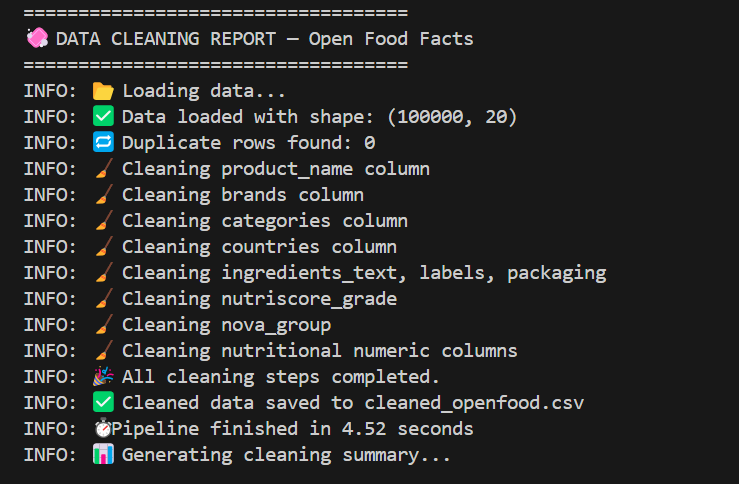
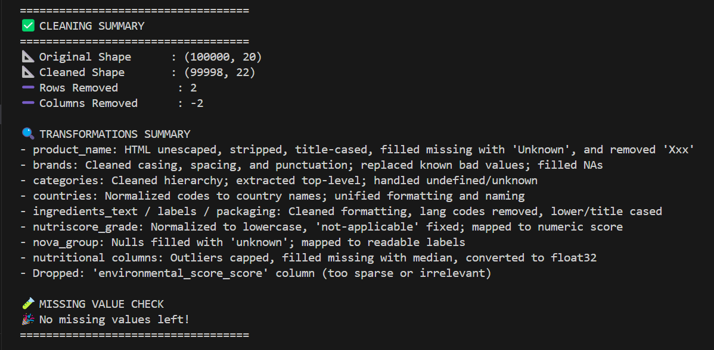

# 🧼 Open Food Facts — Cleaned Dataset (100k Sample)

This project applies a professional and modular **data cleaning pipeline** to a 100K-row subset of the Open Food Facts dataset. The goal: turn messy, inconsistent food product data into a clean, analytics-ready CSV.

---

## 🚀 What This Does

- Applies consistent formatting to **product names, brands, categories**
- Cleans messy **ingredient lists and labels**
- Handles **missing values and outliers** in nutritional columns
- Logs all steps and generates a cleaning summary
- Outputs a final `cleaned_openfood.csv` — ready for dashboards, ML, or analysis

---

## 🖼️ Screenshots

### ✅ Terminal Output

> Full cleaning report with log messages and transformations:





---

### 🧾 Before vs After (Excel View)

> Raw sample vs. Cleaned dataset:

| Raw Excel                               | Cleaned Excel                          |
|----------------------------------------|----------------------------------------|
|      |        |

---
## 🧼 How to Use

```bash
# Install dependencies
pip install -r requirements.txt

# Run the cleaning script
python clean_openfood.py
```

Make sure `working_openfood.csv` is in the same folder or update the path inside the script.

---

## 📁 Folder Structure

```
📁 openfood-cleaning/
├── working_openfood.csv          # Sampled raw data (100k rows)
├── cleaned_openfood.csv          # ✅ Cleaned final output
├── clean_openfood.py             # 🧠 Core cleaning logic
├── assets/
│   ├── cleaning_log_1.png        # 🖥️ Terminal screenshot (part 1)
│   ├── cleaning_log_2.png        # 🖥️ Terminal screenshot (part 2)
│   ├── before_excel.png          # 📸 Before cleaning (Excel)
│   ├── after_excel.png           # 📸 After cleaning (Excel)
├── README.md
```

---

## 🛠️ Tech Stack

- Python (Pandas, logging)
- Excel (for visual diffs)
- Regex, Unicode, and formatting tools

---

## 🔮 Optional Extensions

- Connect to Power BI or Streamlit
- Run EDA and clustering on nutrition values
- Clean full dataset in chunks (batch mode)

---

## 🧑‍💻 Author

Built with ❤️ for real-world data cleaning needs.  
Mohit Kumar 
https://www.linkedin.com/in/mohit-kumar-116753375/

